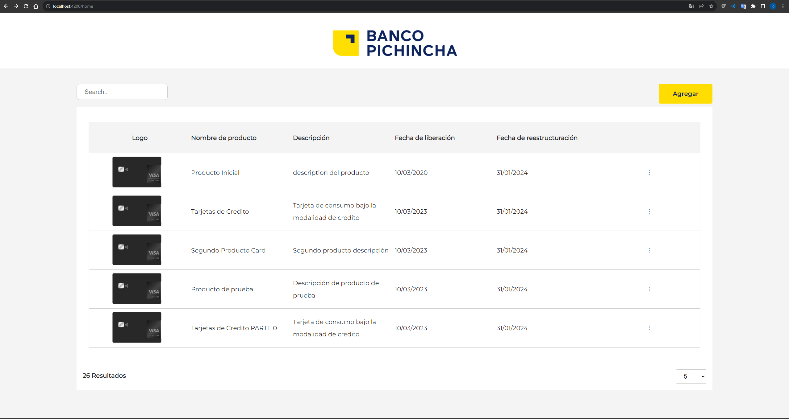
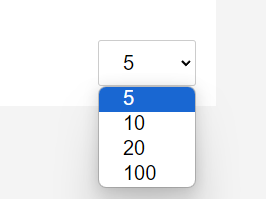
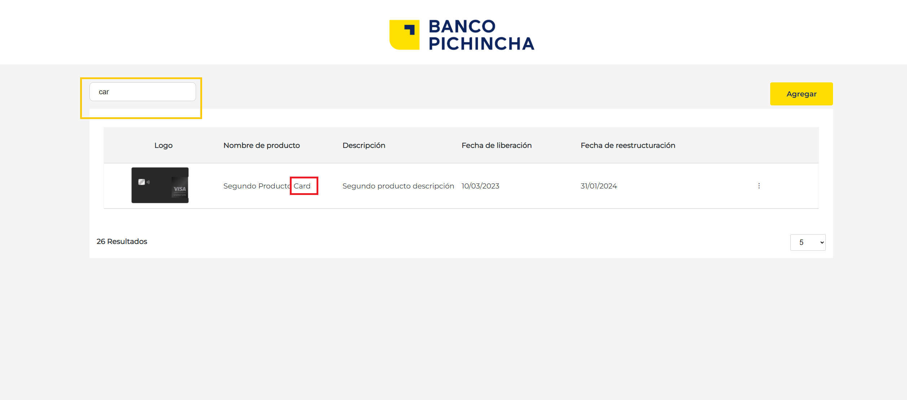
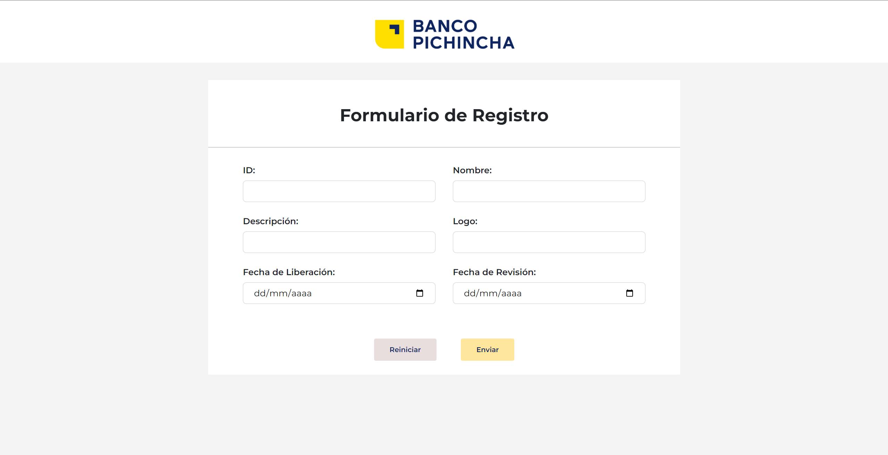
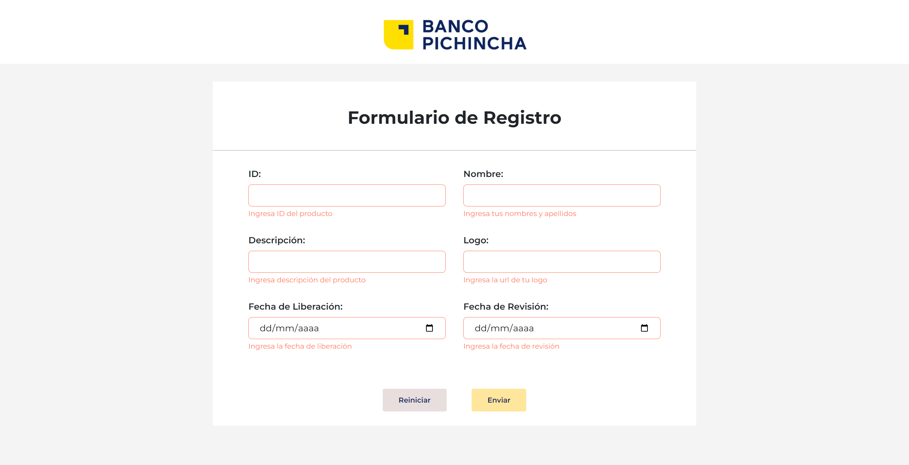
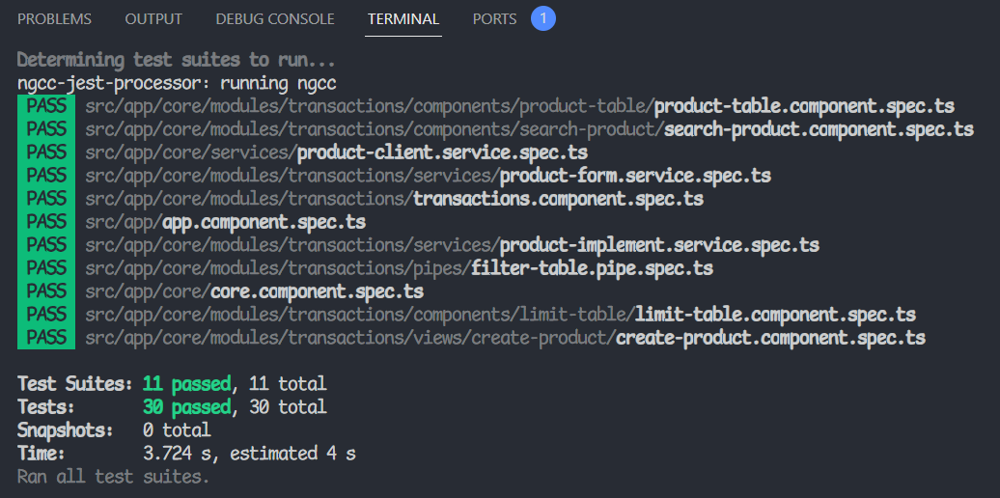

## REPOSITORIO GITHUB: 

`https://github.com/kfabianparedes/prueba-tecnica-devsu`

# Prueba Tecnica Devsu : KEVIN FABIAN

Este proyecto ha sido creado en Angular version 14.2.6.

## Levantar proyecto localmente

1. Una vez clonado el proyecto escribir el comando `npm install` para instalar todas las dependencias
2. Luego de instalar las dependencias, escribir el comando `ng serve` para levantar el proyecto localmente. Ingresar a la siguiente url:  `http://localhost:4200/`.

## Visualizar respuesta de pruebas unitarias
Si desea ver las pruebas unitarias escribir el comando `npm run test:watch` para ver las pruebas mientras se hacen cambios en el código o `npm run test` si solo desea ver el resultado.

---
# Funcionalidades realizadas: F1 - F2 - F3 - F4

## BUSCAR PRODUCTO

---

---

## REGISTRAR PRODUCTO

---

Cuenta con las validaciones del item para cada campo , incluso la validación que es con el servicio.

## PRUEBAS UNITARIAS

# Por falta de tiempo no se pudo realizar: (Pero lo haré en el repositorio igualmente)
## 1. F5 , F6
## 2. Diseño responsive
## 3. Skeleton design
